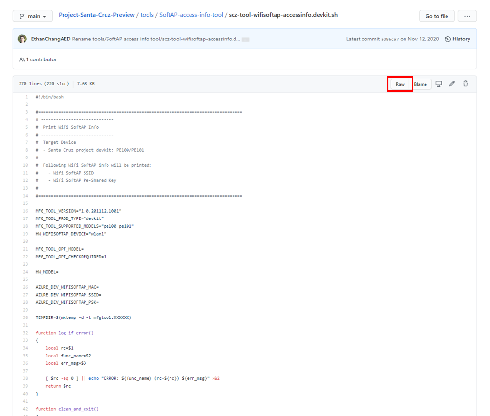

# Collect your device’s TPM-derived SoftAP password

The [SoftAP Tool](https://github.com/microsoft/Project-Santa-Cruz-Preview/blob/main/tools/SoftAP-access-info-tool/scz-tool-wifisoftap-accessinfo.devkit.sh) allows you to access your Project Santa Cruz AI Perception Devkit’s TPM-derived SoftAP password and print it to the console.

New devices built and shipped after 11/17/2020 will contain a Welcome card with your unique SoftAP password printed on a sticker. It is highly recommended that you keep this sticker so you can refer to it when needed. If you do not have a sticker or it was misplaced, you will need to complete the following tasks to retrieve your TPM-derived password from the device.

## What is SoftAP?

SoftAP, or software-enabled access point, allows your device to act as a wireless access point/hotspot through its integrated Wi-Fi module. By connecting to your device's SoftAP hotspot, you can set your device settings through the [OOBE](https://github.com/microsoft/Project-Santa-Cruz-Preview/blob/main/user-guides/getting_started/oobe.md) or [SSH into your device](https://github.com/microsoft/Project-Santa-Cruz-Preview/blob/main/user-guides/general/troubleshooting/ssh_and_serial_connection_setup.md) for [troubleshooting](https://github.com/microsoft/Project-Santa-Cruz-Preview/blob/main/user-guides/general/troubleshooting/general_devkit_troubleshooting.md) and [USB updates](https://github.com/microsoft/Project-Santa-Cruz-Preview/blob/main/user-guides/updating/usb_updating.md), even if your device is not yet connected to your home or office network over Wi-Fi or Ethernet.

## Prerequisites

- [PuTTY](https://www.chiark.greenend.org.uk/~sgtatham/putty/latest.html)
- Host PC
- Project Santa Cruz AI Perception Devkit (PE100 or PE101)
- Devkit IP address

> [!NOTE]
> If your devkit is connected to the SoftAP, your device's IP address will be 10.1.1.1. If your devkit is connected over Ethernet, use the local IP address of the devkit, which you can get from the Ethernet router or hub. If your devkit is connected over Wi-Fi, you must use the IP address that was provided during [OOBE](https://github.com/microsoft/Project-Santa-Cruz-Preview/blob/main/user-guides/getting_started/oobe.md).

## Using the tool

1. Power on your device.

1. Download the [SoftAP tool](https://github.com/microsoft/Project-Santa-Cruz-Preview/blob/main/tools/SoftAP-access-info-tool/scz-tool-wifisoftap-accessinfo.devkit.sh) to your local PC. To download the tool in the correct UNIX format, follow these steps:

    1. Click the SoftAP tool link above.

    1. In the GitHub file window, click **Raw**.

        

    1. In the new window containing the raw file, right click and select **Save as**.

    1. Navigate to your preferred destination folder, and click **Save**. The file should now be saved in the correct UNIX format for executing on your devkit. If you did not save the file properly, you may receive an error of the following format when running the script:

        ```bash
        -bash: ./scz-tool-wifisoftap-accessinfo.devkit.sh: /bin/bash: bad interpreter: No such file or directory
        ```

1. Copy the tool to your device by entering the following command into a command prompt or terminal. This command should work for Windows or Linux PC's.  

    ```
    scp [local file path]\scz-tool-wifisoftap-accessinfo.devkit.sh [username]@[remote server]:./
    ```
    
    In this case, ```[remote server]``` is the IP address of your device. ```[username]``` is either root or the username you defined in OOBE during SSH setup. The file will be placed in ~/home folder on your device which is the default folder shown after SSH logon. Enter your password when prompted.  The root SSH password for your device, if not changed, is p@ssw0rd.

1. Open PuTTY and [SSH into your device](https://github.com/microsoft/Project-Santa-Cruz-Preview/blob/main/user-guides/general/troubleshooting/ssh_and_serial_connection_setup.md).

1. In the PuTTY terminal, enter the following command to change the permissions of the file to allow execution:  

    ```
    chmod 755 ./scz-tool-wifisoftap-accessinfo.devkit.sh
    ```

1. Execute the file on your device to output your TPM-derived SoftAP password:  Note: If you are not signed in as root, you must add ```sudo ``` in front of the below command and enter your username password when prompted.

    ```
    ./scz-tool-wifisoftap-accessinfo.devkit.sh -m=pe101
   ```
    --or--
    ```
    sudo ./scz-tool-wifisoftap-accessinfo.devkit.sh -m=pe101
    ```

    > [!NOTE]
    > If your device model is PE100, change the above command to ```./scz-tool-wifisoftap-accessinfo.devkit.sh -m=pe100```.

    Example output:

    ```
    Wifi-SoftAP MAC Address: 1234567890ab
    Wifi-SoftAP SSID: scz-0000
    Wifi-SoftAP Pre-Shared Key: asdf1234  
    ```

1. The ```Wifi-SoftAP Pre-Shared Key``` is your devkit’s TPM-derived SoftAP password. Write down and securely store this password.
