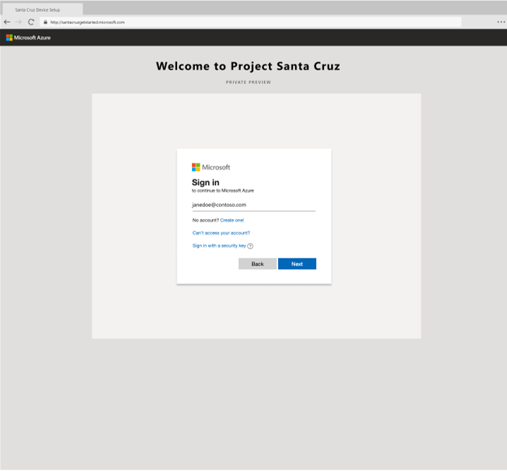
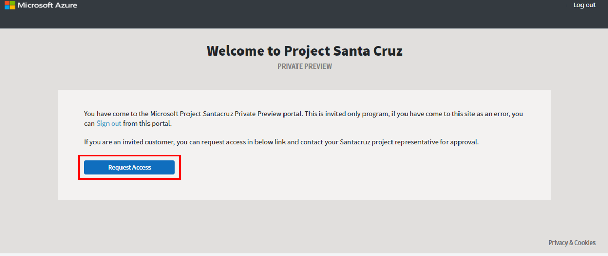
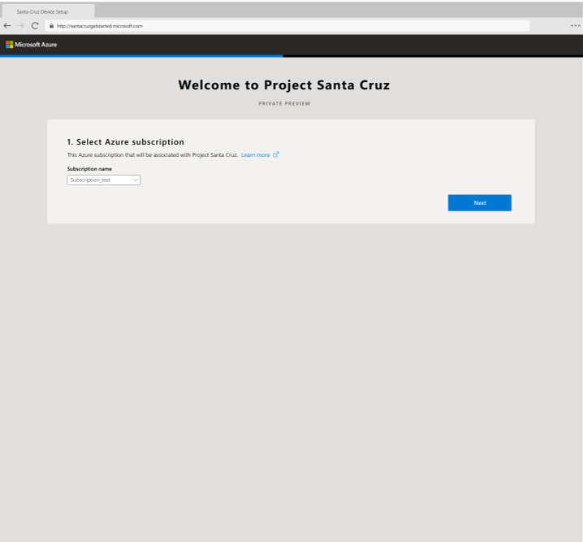
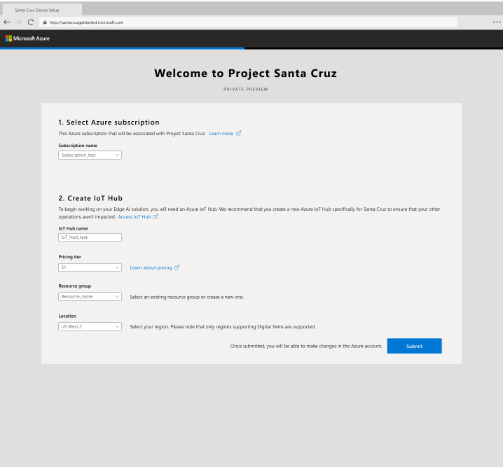
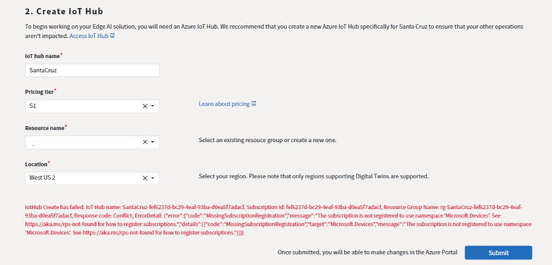
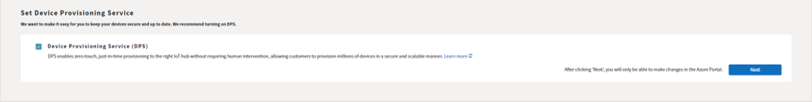
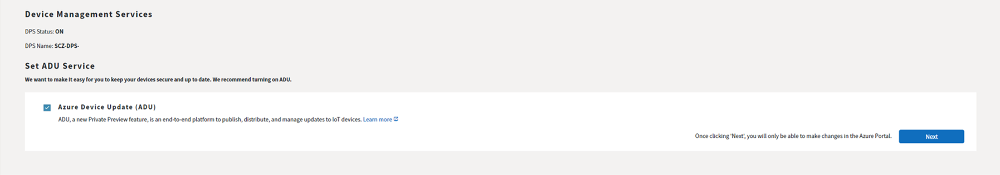
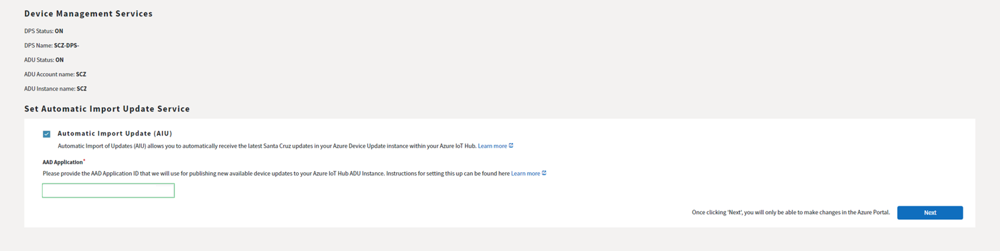
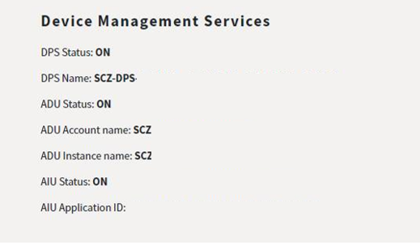

<!---
title: Project Santa Cruz onboarding                     # the article title to show on the browser tab
description: Walks a user through the onboarding process for Project Santa Cruz Private Preview (July 2020). 
author: elqu20      # the author's GitHub ID - will be auto-populated if set in settings.json
ms.author: v-elqu     # the author's Microsoft alias (if applicable) - will be auto-populated if set in settings.json
ms.date: {@date}           # the date - will be auto-populated when template is first applied
ms.topic: reference  # the type of article
--->
# Project Santa Cruz onboarding

Welcome to Project Santa Cruz! Prior to getting started with Santa Cruz devkits and devices, please complete the onboarding as described herein. The onboarding process involves connecting an appropriate Azure subscription and IoT Hub to Project Santa Cruz, which allows you to connect, manage, and update your devices with ease. Perform the following steps to complete the onboarding:

1. Open a browser and enter https://projectsantacruz.microsoft.com/ in the address bar to open the onboarding tool.  

1. Enter your account login details and click **Next**.

    > [!NOTE]
    >To ensure you onboard the correct Azure subscription, you must log into the site with an Azure Active Directory-enabled account that is a member of the Azure subscription you wish to onboard. In most cases, users will want to onboard a subscription from their company's Azure account, in which case they should log in with their corporate credentials. If you want to onboard an Azure subscription that is different than your corporate subscription, you will need to log in with a user account that is a member of that subscription. If you do not have a user account for that subscription, or if your company does not use Azure Active Directory, you can follow [these instructions](https://github.com/microsoft/Project-Santa-Cruz-Preview/blob/main/user-guides/getting_started/msa_account_onboarding_access.md) to create an account. Once you have successfully created your new user, return to this article for guidance on completing the rest of the onboarding process.

    

1. Click **Request access**. It may take up to 2 business days to process your request to access the onboarding portal.

    

1. Once you have access to the onboarding portal through the URL above, click **Get Started** on the onboarding welcome screen.

1. Select the Azure subscription you would like to use with Project Santa Cruz from the drop-down menu. If you do not have an Azure subscription, or if you would like to create a new subscription to use with Project Santa Cruz, click the blue **Learn more** icon. This link redirects to the Azure website where you may create a new Azure account. Note that the free account, which currently provides $200 in credits to use within 30 days of the account opening, is sufficient to get started with Project Santa Cruz. Your account credit card will be charged for usage following the exhaustion or expiration of the credits. After you have selected the appropriate Azure subscription from the drop-down on the onboarding screen, click **Next**.

    

1. Create an IoT Hub.  

    1. Enter your IoT Hub name. It is recommended that you create a new IoT Hub for working solely with Project Santa Cruz.  

    1. Select your hub’s pricing tier from the drop-down menu. The S1 tier is recommended for use with Project Santa Cruz because other pricing tiers do not support IoT Edge, which is required. Note that Azure account credits may be used towards IoT Hub fees.

    1. Select a resource group from the drop-down menu or create a new one.  

    1. Select your location from the drop-down menu. Note that you may use any available region regardless of your country of residence.  

    1. After selecting your IoT Hub properties, click **Submit**. It will take a few minutes to create and activate your new IoT Hub. After submitting, any changes to your IoT Hub properties can be made in your [Azure account](https://ms.portal.azure.com/?feature.canmodifystamps=true&Microsoft_Azure_Iothub=aduprod#home).

        

    1. In some cases, you may receive the following error message after clicking **Submit**:

        

        The error message indicates that your Azure subscription is not registered to use the **Microsoft.Devices** namespace. To fix this, register your Azure subscription through the Azure portal by following the steps described [here](https://docs.microsoft.com/en-us/azure/azure-resource-manager/templates/error-register-resource-provider). There is no charge associated with the **Microsoft.Devices** namespace. Wait approximately 30 minutes after registering before trying to create your IoT Hub through the onboarding tool again.

1. After creating your IoT Hub, you will see a new option at the bottom of the screen for enabling the Device Provisioning Service (DPS). Check the box and click **Next** to create your DPS instance and link it to your IoT Hub. This may take a few minutes to complete. When finished, you will see a new section for **Device Management Services** that lists your DPS status (**ON**) and your DPS name.

      

1. Next, you will see an option at the bottom of the screen for enabling Azure Device Update (ADU). We recommend enabling ADU so you may update your devkit [over-the-air (OTA)](https://github.com/microsoft/Project-Santa-Cruz-Preview/blob/main/user-guides/updating/ota_update.md). Check the box and click **Next** to create your ADU account. This may take a few minutes to complete. When finished, you will see your ADU status (**ON**), ADU account name, and ADU instance name listed under **Device Management Services** on your screen.

    

1. Finally, you will see an option at the bottom of the screen for enabling Automatic Import Update (AIU). Like the name implies, AIU automatically imports new device updates into your ADU account, removing the need to manually download update files from the [Project Santa Cruz Update Management website](https://projectsantacruz.microsoft.com/Download). Please note that AIU is not required to perform OTA updates. To enable AIU, first complete the steps detailed in this [AIU setup guide](https://github.com/microsoft/Project-Santa-Cruz-Preview/blob/main/user-guides/updating/automatic_import_of_updates.md). When you are done, check the box, enter your AAD Application ID, and click **Next**.

    

1. After enabling AIU, you will see your AIU status (**ON**) and your AIU application ID listed under **Device Management Services** on your screen.

    

Congratulations! You have successfully completed the onboarding tool and are ready to get started with Project Santa Cruz. Any changes to the settings you selected in the onboarding tool can now be made in your in your [Azure account](https://ms.portal.azure.com/?feature.canmodifystamps=true&Microsoft_Azure_Iothub=aduprod#home) (this link allows you to access the Azure Device Update extension, which is a Private Preview service).  

## Next steps

Once you have received a Project Santa Cruz Development Kit, please see the [unboxing guide](https://github.com/microsoft/Project-Santa-Cruz-Private-Preview/blob/main/user-guides/getting_started/devkit-unboxing-setup.md) for information on powering on your device and accessing the [OOBE (out of box experience)](https://github.com/microsoft/Project-Santa-Cruz-Private-Preview/blob/main/user-guides/getting_started/oobe.md).
