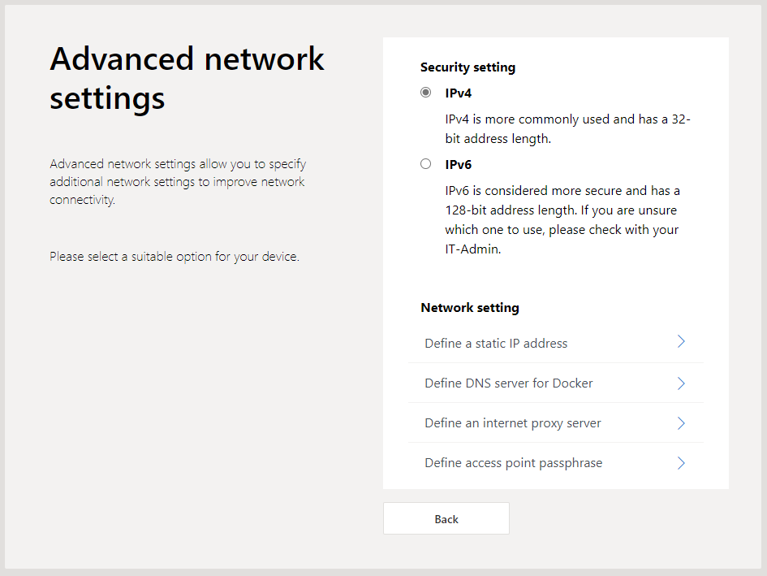
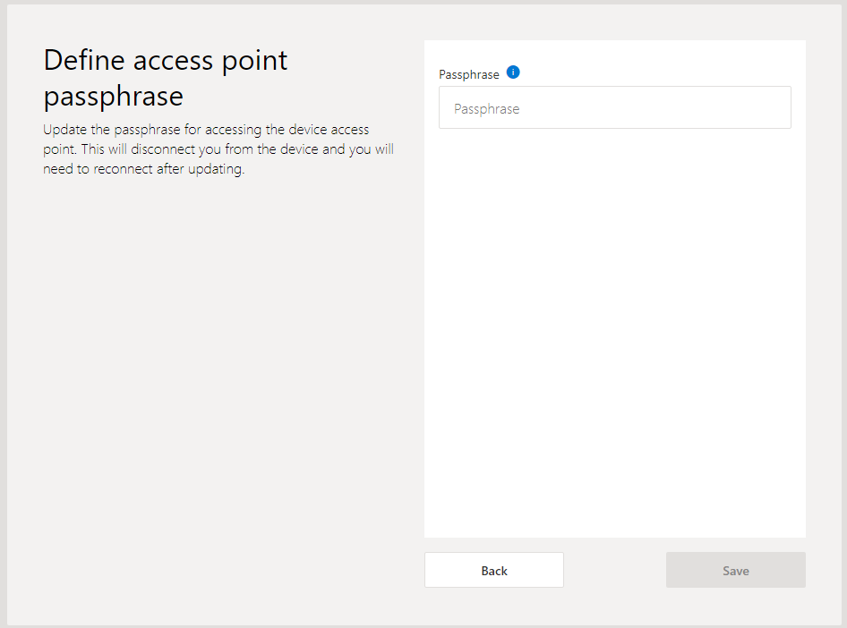
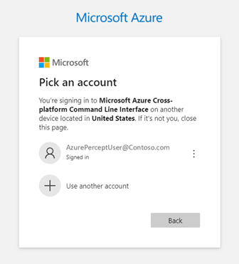

# OOBE (out-of-box experience) Walkthrough

After completing the [onboarding](https://github.com/microsoft/Project-Santa-Cruz-Private-Preview/blob/main/user-guides/getting_started/azure-subscription-onboarding.md) for Project Santa Cruz Private Preview and [setting up your devkit](https://github.com/microsoft/Project-Santa-Cruz-Private-Preview/blob/main/user-guides/getting_started/devkit-unboxing-setup.md), you may proceed with the OOBE (out-of-box experience). The OOBE walks you through the process of connecting your devkit to a Wi-Fi network, setting up an SSH login for your devkit, connecting your devkit to your Azure account, and assigning your devkit to your Project Santa Cruz IoT Hub.  

## Prerequisites

- Project Santa Cruz devkit
- Ethernet cable (optional)
- [Onboarding](https://github.com/microsoft/Project-Santa-Cruz-Private-Preview/blob/main/user-guides/getting_started/azure-subscription-onboarding.md) completed
- Project Santa Cruz Devkit [setup](https://github.com/microsoft/Project-Santa-Cruz-Private-Preview/blob/main/user-guides/getting_started/devkit-unboxing-setup.md) completed
- Device with Wi-Fi connectivity and browser

## Connecting to OOBE for Initial Setup

### What is SoftAP?

SoftAP, or software-enabled access point, allows your devkit to act as a wireless access point/hotspot through its integrated Wi-Fi module. The devkit's SoftAP IP address is 10.1.1.1. We will be using the devkit's SoftAP for the initial setup.

### Connect to OOBE

**Warning: If completing OOBE via a mobile device, be aware that data rates from your mobile carrier may apply.**

1. To get started, power on your devkit.

1. If the host computer you will be using has an active WWAN/Cellular connection, disconnect from it before proceeding.  This can sometimes cause interference to the SoftAP.

1. From your host computer, establish a Wi-Fi connection to the devkit's SoftAP. This varies by platform (Windows/Linux/Mac).

    1. SoftAP/Hotspot SSID: scz-xxxx    (where xxxx = the last four digits of the devkit's Wi-Fi MAC address)
    2. Password: santacruz              (if you have already manually set your SoftAP password during the OOBE, enter that password here)

     
    
    > [!NOTE]
    > If you experience issues while trying to connect with the devkit's SoftAP please review the [known issues](https://github.com/microsoft/Project-Santa-Cruz-Preview/blob/main/release-notes/known-issues.md) page.
    > Windows may complain about the SoftAP using a less secure standard (WPA2+TKIP cipher). This will be addressed in a future build to only allow connections via the CCMP pairwise cipher.

1. Open a browser and go to http://10.1.1.1:4242 to access the OOBE. If you have already flashed your device to a newer build, use http://10.1.1.1.

## OOBE procedure

1. Click **Next** on the OOBE **Welcome** screen.  

    

1. On the **Network connection** page, click **Connect to a new WiFi network** to connect your devkit to a Wi-Fi network.

    

1. Select your Wi-Fi network from the available connections.

    >[!NOTE] The Wi-Fi network you connect to must currently have internet connectivity so we can communicate with Azure. EAP[PEAP/MSCHAP], captive portals, and Enterprise EAP-TLS connectivity is currently not supported.

    

1. Write down the IP address you are shown once a connection is established. You will want to use this IP address after OOBE completes for viewing the Preview Video Output instead of 10.1.1.1:3000. You can also use this IP address for [SSH sessions](https://github.com/microsoft/Project-Santa-Cruz-Preview/blob/main/user-guides/general/troubleshooting/ssh_and_serial_connection_setup.md) and connecting to OOBE. Once you’ve noted your IP address, navigate to the **Network connection** page.

    

1. On the **Network connection** page, click **Access advanced network settings**.

1. On the **Advanced network settings** page, click **Define access point passphrase**.

    

1. On the **Define access point passphrase** page, enter a passphrase/password for your device's SoftAP hotspot and click **Save**. After changing your password, you will be disconnected from the SoftAP and will need to reconnect your device to proceed with the OOBE. Instead of reconnecting to the SoftAP with your new password, we recommend connecting to either your Wi-Fi network that was set up in a previous step or over Ethernet. Once you are back on your home/office network, use the IP address you noted from above to restart OOBE (if connected over Ethernet, use the IP gathered from your router) and skip the Wi-Fi connection screen. To restart OOBE, open a browser and go to http://<your_devices_ip>:4242 or http://<your_devices_ip>, depending on your build.

    

1. Read through the License Agreement, select **I have read and agree to the License Agreement**, and click **Next**.

    

1. If you would like to set up SSH for remote access to your devkit, enter your SSH username and password. To disable the root SSH login (username = root, password = p@ssw0rd), check the box next to **SSH Root Login Disabled (Recommended)**. To prevent brute force security attacks, we recommend keeping SSH root login disabled. If you are an advanced user and choose to enable root login, please enable appropriate security measures for your deployment environment. Finally, click **Save**.  

    

1. On the next screen, click **Connect with a new device** to begin the process of linking your devkit to Azure.  To check your Azure subscription status go to https://ms.portal.azure.com/#home, then tap Subscriptions. 

    

1. Click **Copy** to copy your device code (this may take a few seconds to generate). Once you have copied your device code, click **Login to Azure**, which opens a new browser tab.

    

    1. On the new browser tab, paste the device code you copied in the previous step into the window and click **Next**.

        

    1. Sign into your Azure account (the same account used during the onboarding process) and click **Next**. Navigate back to the OOBE window, which will show “Successfully Linked” once account sign-in is successful.

        

1. Select the IoT Hub you created during the [onboarding](https://github.com/microsoft/Project-Santa-Cruz-Preview/blob/main/user-guides/getting_started/azure-subscription-onboarding.md) process to assign it to your devkit. If you are not sure which IoT Hub was created during onboarding, please check the [onboarding website](https://projectsantacruz.microsoft.com/).

    

1. Enter a device name for your devkit, check the TPM enrollment box, and click **Next**.  

    

1. Congratulations! Your devkit has been successfully linked to your Azure account and Project Santa Cruz IoT Hub. You may now access your device within the [Azure Portal](https://portal.azure.com/?feature.canmodifystamps=true&Microsoft_Azure_Iothub=aduprod&microsoft_azure_marketplace_ItemHideKey=Microsoft_Azure_ADUHidden#home). Before doing so, disconnect your computer from the devkit's SoftAP.

    > [!NOTE]
    > The Preview Video Output hyperlink on the final screen will no longer work once disconnected. Instead, use the IP address you wrote down in step 4 to preview the video output for the best streaming performance: http://<your_noted_IP_address>:3000.
    > If you need to [SSH into your devkit](https://github.com/microsoft/Project-Santa-Cruz-Preview/blob/main/user-guides/general/troubleshooting/ssh_and_serial_connection_setup.md), use <your_noted_IP_address>.

   
  
## Notes

1. To protect your security, after 30 minutes of inactivity, we stop the OOBE process (and we remove the port 80 allow rule). If this occurs, please restart the OOBE.
1. If at anytime during OOBE you see blue dots and then OOBE restarts, this is due to losing internet connectivity. Please verify you have a consistent internet connection. 
1. During the WiFi connection, three blue dots will be shown.  These will go away once the WiFi connection has been established.
1. Captive portal is not supported on IPV6
1. If you have added an IoT Hub outside of OOBE, please refresh the browser and wait a few minutes for it propogate on the IoT Hub screen.

## Update your device's root SSH password

The root SSH password for your device (p@ssw0rd) will expire after 90 days. We recommend updating this password now to avoid any interruption to root SSH access.

1. [SSH into your device](https://github.com/microsoft/Project-Santa-Cruz-Preview/blob/main/user-guides/general/troubleshooting/ssh_and_serial_connection_setup.md) with the root login:
    - User: root
    - Password: p@ssw0rd
1. You will be prompted to enter a new password, which must contain letters and numbers and be least 12 characters in length. Type your new password into the PuTTY terminal and hit **Enter**.
1. Write down your password in a safe place.
1. You are now free to close the PuTTY terminal.

## Provide Feedback

After completing the OOBE, please provide feedback on your experience via this [questionnaire](https://forms.office.com/Pages/ResponsePage.aspx?id=v4j5cvGGr0GRqy180BHbRzoJxrXKT0dEvfQyxsA0h8lUOEpDRkxZSUFWMFc2SEZYMDBBSlVQMUZMMy4u). Your feedback will help us continue to fine-tune and improve the OOBE experience.

For more information on Project Santa Cruz Quests and to provide feedback on other experiences, please visit the [test scenarios page](https://github.com/microsoft/Project-Santa-Cruz-Private-Preview/blob/main/user-guides/general/test-scenarios.md).

## Next Steps

You may now begin solution development with your Project Santa Cruz Development Kit. To get started, check out the [no-code vision experience](https://github.com/microsoft/Project-Santa-Cruz-Private-Preview/blob/main/user-guides/prototyping/create-nocode-vision.md) and [no-code speech experience](https://github.com/microsoft/Project-Santa-Cruz-Private-Preview/blob/main/user-guides/prototyping/nocode-speech.md) to create, train, and deploy simple AI models to your device.
