# OOBE (out-of-box experience) Walkthrough

After completing the [onboarding](https://github.com/microsoft/Project-Santa-Cruz-Private-Preview/blob/main/user-guides/getting_started/azure-subscription-onboarding.md) for Project Santa Cruz Private Preview and [setting up your devkit](https://github.com/microsoft/Project-Santa-Cruz-Private-Preview/blob/main/user-guides/getting_started/devkit-unboxing-setup.md), you may proceed with the OOBE (out-of-box experience). The OOBE walks you through the process of connecting your devkit to a Wi-Fi network, setting up an SSH login for your devkit, connecting your devkit to your Azure account, and assigning your devkit to your Project Santa Cruz IoT Hub.  

## Prerequisites

- Project Santa Cruz devkit
- Ethernet cable (optional)
- [Onboarding](https://github.com/microsoft/Project-Santa-Cruz-Private-Preview/blob/main/user-guides/getting_started/azure-subscription-onboarding.md) completed
- Project Santa Cruz Devkit [setup](https://github.com/microsoft/Project-Santa-Cruz-Private-Preview/blob/main/user-guides/getting_started/devkit-unboxing-setup.md) completed
- Computer with Wi-Fi connectivity

## Connecting to OOBE

You can connect to and start OOBE through any of the following interfaces: SoftAP, Wi-Fi, or Ethernet. Replace **<your_devices_ip>** in the table below with your device's corresponding IP address.

If connecting over the SoftAP, your IP address will be 10.1.1.1. If connecting over Ethernet, use the local IP address of the devkit, which you can get from the Ethernet router or hub. Connecting over Wi-Fi requires the device IP address that is provided during the OOBE (step 4 of the OOBE procedure below).

OOBE Web Address |      Note
------------------ | ----------------
http://<your_devices_ip>:4242 | for builds released prior to 09/08/2020
http://<your_devices_ip> | for builds released on or after 09/08/2020

**We do NOT recommend using a mobile device for the OOBE unless you only want to configure non-IoT Hub items.**

1. To get started, power on your devkit.

1. If you wish to connect your devkit over Ethernet, connect the Ethernet cable to the devkit and to your Ethernet hub or port. Otherwise, open your network and internet settings on your computer and connect to the SoftAP:

    1. SoftAP/Hotspot SSID: scz-xxxx    (where xxxx = the last four digits of the devkit's Wi-Fi MAC address)
    2. Password: santacruz              (if you have already manually set your SoftAP password during the OOBE, enter that password here)

    > [!NOTE]
    > Windows may complain about the SoftAP using a less secure standard (WPA2+TKIP cipher). This will be addressed in a future build to only allow connections via the CCMP pairwise cipher.

1. Open a browser and go to http://<your_devices_ip>:4242 or http://<your_devices_ip>, depending on your build as noted above.

## OOBE procedure

1. Click **Next** on the OOBE **Welcome** screen.  

    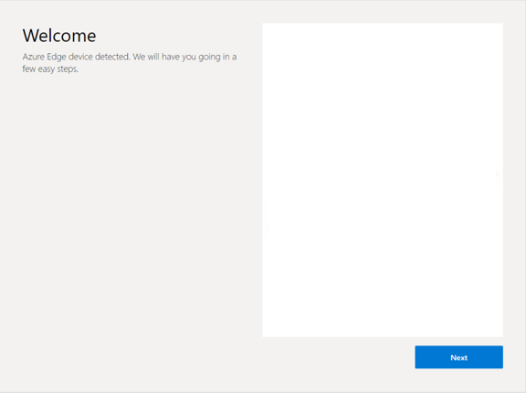

1. On the **Network connection** page, click **Connect to a new WiFi network** to connect your devkit to a Wi-Fi network.

    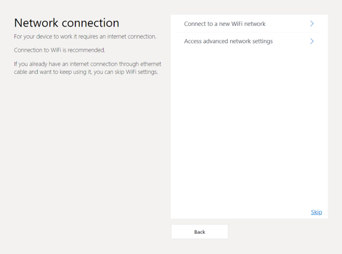

1. Select your Wi-Fi network from the available connections.

    >[!NOTE] The Wi-Fi network you connect to must currently have internet connectivity so we can communicate with Azure. EAP[PEAP/MSCHAP], captive portals, and Enterprise EAP-TLS connectivity is currently not supported.

    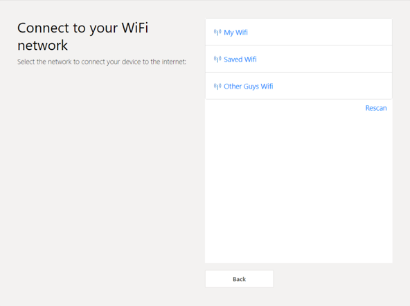

1. Once your devkit has successfully connected to your network of choice, write down the IP address you are shown. You can use this IP address for OOBE or SSH sessions. Then, navigate back to the **Network connection** page.

    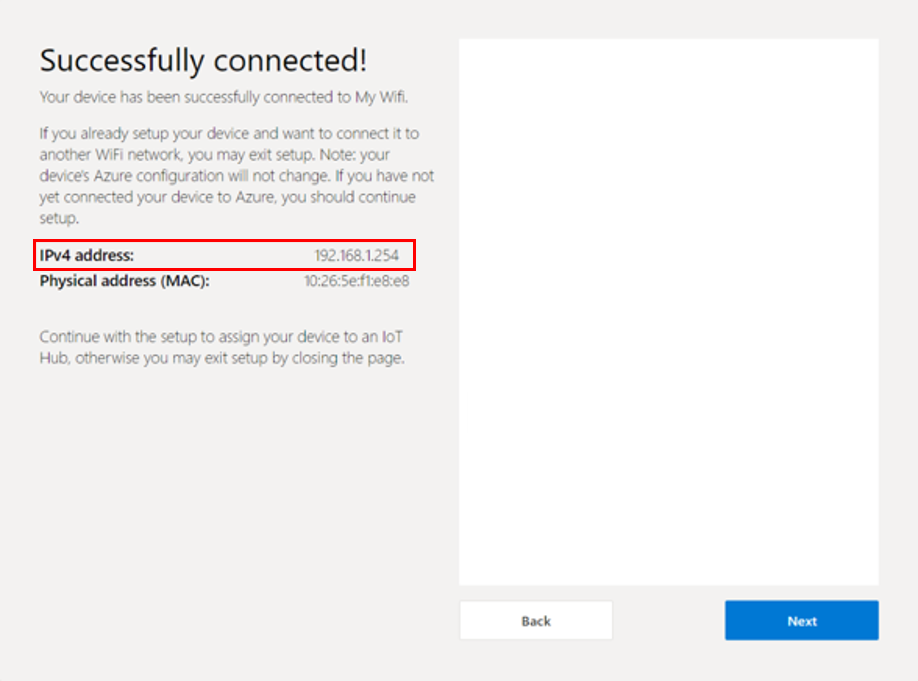

1. On the **Network connection** page, click **Access advanced network settings**.

1. On the **Advanced network settings** page, click **Define access point passphrase**.

    

1. On the **Define access point passphrase** page, enter a passphrase/password for your device's SoftAP hotspot and click **Save**. After changing your password, you will be disconnected from the SoftAP and will need to reconnect your device to proceed with the OOBE. Instead of reconnecting to the SoftAP with your new password, we recommend connecting to either your Wi-Fi network that was set up in a previous step or over Ethernet. Once you are back on your home/office network, use the IP address you noted from above to restart OOBE (if connected over Ethernet, use the IP gathered from your router) and skip the Wi-Fi connection screen. To restart OOBE, open a browser and go to http://<your_devices_ip>:4242 or http://<your_devices_ip>, depending on your build.

    

1. Read through the License Agreement, select **I have read and agree to the License Agreement**, and click **Next**.

    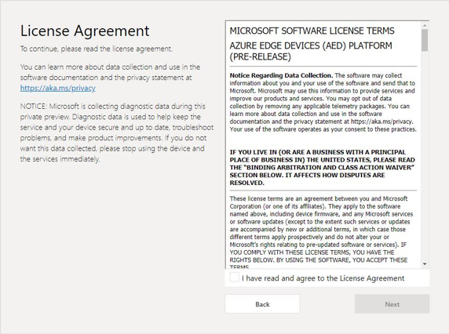

1. If you would like to set up SSH for remote access to your devkit, enter your SSH username and password. To disable the root SSH login (username = root, password = p@ssw0rd), check the box next to **SSH Root Login Disabled (Recommended)**. To prevent brute force security attacks, we recommend keeping SSH root login disabled. If you are an advanced user and choose to enable root login, please enable appropriate security measures for your deployment environment. Finally, click **Save**.  

    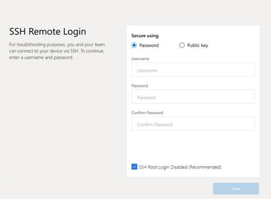

1. On the next screen, click **Connect with a new device** to begin the process of linking your devkit to Azure.

    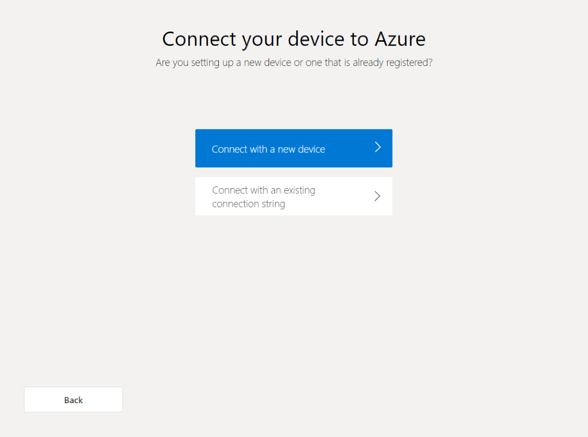

1. Click **Copy** to copy your device code (this may take a few seconds to generate). Once you have copied your device code, click **Login to Azure**, which opens a new browser tab.

    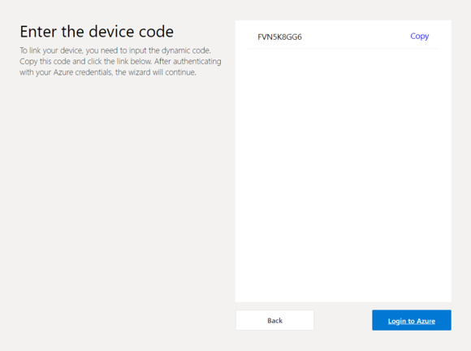

    1. On the new browser tab, paste the device code you copied in the previous step into the window and click **Next**.

        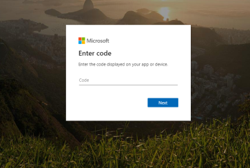

    1. Sign into your Azure account (the same account used during the onboarding process) and click **Next**. Navigate back to the OOBE window, which will show “Successfully Linked” once account sign-in is successful.

        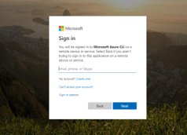

1. Select the IoT Hub you created during the onboarding process to assign it to your devkit. The asterisk "*" indicates IoT Hubs with DPS enabled. If you are not sure which IoT Hub name you created during the onboarding process, you can review it by accessing https://projectsantacruz.microsoft.com/.

    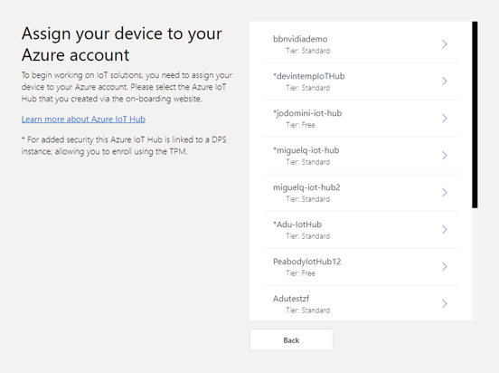

1. Enter a device name for your devkit, check the TPM enrollment box, and click **Next**.  

    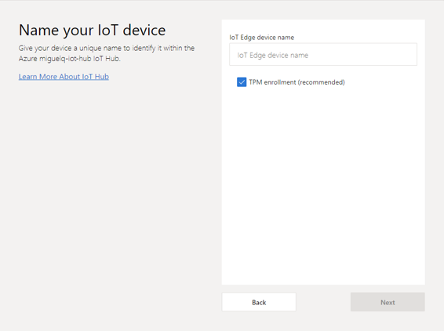

1. Congratulations! Your devkit has been successfully linked to your Azure account and Project Santa Cruz IoT Hub. You may now access your device within the [Azure Portal](https://ms.portal.azure.com/?feature.canmodifystamps=true&Microsoft_Azure_Iothub=aduprod#home).

  >[!NOTE] If your **Preview Video Output** link is using 10.1.1.1:3000, we recommend you disconnect your PC from the SoftAP as outlined in step 5 and use http://<your_noted_IP_address>:3000 to get the best experience.
  
   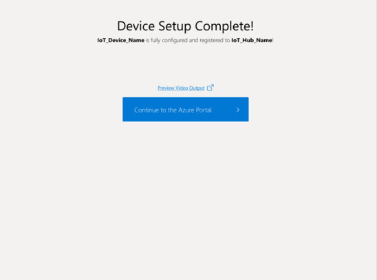

## Notes

To protect your security, after 30 minutes of inactivity, we stop the OOBE process (and we remove the port 80 allow rule). If this occurs, please restart the OOBE.

## Provide feedback

After completing the OOBE, please provide feedback on your experience via this [questionnaire](https://forms.office.com/Pages/ResponsePage.aspx?id=v4j5cvGGr0GRqy180BHbRzoJxrXKT0dEvfQyxsA0h8lUOEpDRkxZSUFWMFc2SEZYMDBBSlVQMUZMMy4u). Your feedback will help us continue to fine-tune and improve the OOBE experience.

For more information on Project Santa Cruz Quests and to provide feedback on other experiences, please visit the [test scenarios page](https://github.com/microsoft/Project-Santa-Cruz-Private-Preview/blob/main/user-guides/general/test-scenarios.md).

## Next Steps

You may now begin solution development with your Project Santa Cruz Development Kit. To get started, check out the [no-code vision experience](https://github.com/microsoft/Project-Santa-Cruz-Private-Preview/blob/main/user-guides/prototyping/create-nocode-vision.md) and [no-code speech experience](https://github.com/microsoft/Project-Santa-Cruz-Private-Preview/blob/main/user-guides/prototyping/nocode-speech.md) to create, train, and deploy simple AI models to your device.
