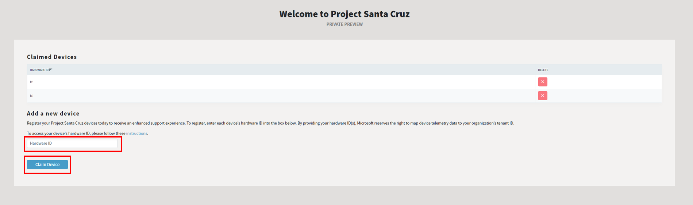

# Register your Project Santa Cruz device

Register your Project Santa Cruz devices today to receive an enhanced support experience. By providing your hardware ID(s), Microsoft reserves the right to map device telemetry data to your organization’s tenant ID. To register your devices, follow the steps below.

## Prerequisites

- Project Santa Cruz devkit
- [Onboarding](https://github.com/microsoft/Project-Santa-Cruz-Preview/blob/main/user-guides/getting_started/azure-subscription-onboarding.md) completed
- Host PC
- [PuTTY](https://www.chiark.greenend.org.uk/~sgtatham/putty/latest.html)

## Collect your device's hardware ID

1. Power on your devkit.

1. [SSH](https://github.com/microsoft/Project-Santa-Cruz-Preview/blob/main/user-guides/general/troubleshooting/ssh_and_serial_connection_setup.md) into the device and log in as root.

1. In the PuTTY terminal, enter the following command:

    ```powershell
    azure-device-health-id
    ```

1. You should see a long GUID that starts with “t:” – copy the entire GUID. If your GUID starts with "m:" or another character, please contact aedppsup@microsoft.com for support.

1. Open a browser window and enter https://projectsantacruz.microsoft.com/ClaimDevice.

1. Paste the ID collected in step 4 into the **Hardware ID** box under **Add a new device** and click **Claim Device**.

    

1. Repeat process for additional devices.
