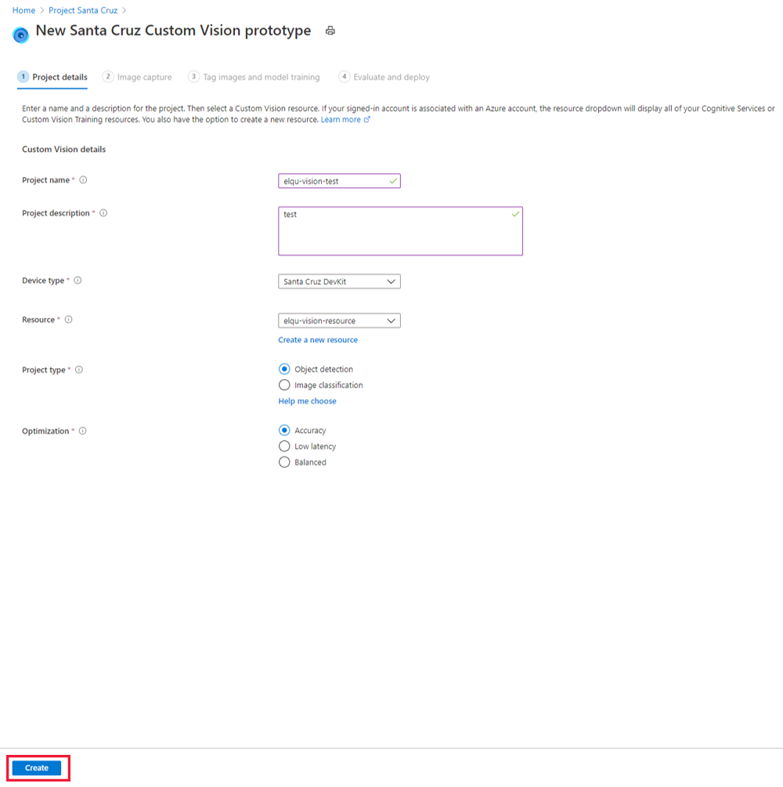

# Create a no-code vision solution and deploy it to a Project Santa Cruz Development Kit

Project Santa Cruz enables you to build and deploy complete computer vision solutions, from simple no-code models to more advanced solutions. This article will guide you through the process of creating, training, and deploying a custom object detection or image classification model to your devkit. This is a no-code solution that is suitable for developers with little to no AI experience and those just getting started with Project Santa Cruz.

## Prerequisites

* Project Santa Cruz Development Kit with the Azure Eye SoM connected.

* [Onboarding](https://github.com/microsoft/Project-Santa-Cruz-Private-Preview/blob/main/user-guides/getting_started/azure-subscription-onboarding.md) has been completed.

* [OOBE](https://github.com/microsoft/Project-Santa-Cruz-Private-Preview/blob/main/user-guides/getting_started/oobe.md) has been completed.

## Create a vision prototype

1. Start your browser and go to the [Project Santa Cruz portal](https://go.microsoft.com/fwlink/?linkid=2135819).

1. On the **Project Santa Cruz Overview** page, click the **Demos & tutorials** tab.

    

1. Under **Vision tutorials and demos**, click **Create a vision prototype**.

    

1. On the **New Santa Cruz Custom Vision prototype** page, do the following:

    1. In the **Project name** box, enter a name for your vision prototype.

    1. Enter a description of the vision prototype in the **Project description** box.

    1. Select **Santa Cruz Devkit** under the **Device type** drop-down menu.

    1. Select a resource under the **Resource** drop-down menu or click **Create a new resource**. If you elect to create a new resource, do the following in the **Create** window:
        1. Enter a name for your new resource.
        1. Select your Azure subscription.
        1. Select a resource group or create a new one.
        1. Select your preferred region.
        1. Select your pricing tier (we recommend S0).
        1. Click **Create** at the bottom of the window.
        
            

    1. For **Project type**, choose whether your vision project will perform object detection or image classification. For more information on the project types, click **Help me choose**.

    1. For **Optimization**, select whether you want to optimize your project for accuracy, low network latency, or a balance of both.

    1. Click the **Create** button.

    

## Connect a device to your project and capture images

After creating a vision solution, you must add a device and its corresponding IoT Hub to it:

1. Power on your devkit.

1. In the **IoT Hub** dropdown menu, select the IoT hub to which your devkit was provisioned during the [OOBE](https://github.com/microsoft/Project-Santa-Cruz-Private-Preview/blob/main/user-guides/getting_started/oobe.md).

1. In the **Devices** dropdown menu, select your devkit.

Next, you must either load images or capture images for training your AI model. We recommended uploading at least 30 images per tag type. For example, if you want to build a dog and cat detector, you must upload at least 30 images of dogs and 30 images of cats. To capture images with the Eye SoM of your devkit, do the following:

1. In the **Image capture** window, select **View device stream** to view the Eye SoM video stream.

1. Check the video stream to ensure that your Eye SoM camera is correctly aligned to take the training pictures. Make adjustments as necessary.

1. In the **Image capture** window, click **Take photo**.

    

1. Alternatively, set up an automated image capture to collect a large quantity of images at a time by checking the **Automatic image capture** box. Select your preferred imaging rate under **Capture rate** and the total number of images you would like to collect under **Target**. Click **Set automatic capture** to begin the automatic image capture process.

    

When you have enough photos, click **Next: Tag images and model training** at the bottom of the screen. All images will be saved in [Custom Vision](https://www.customvision.ai/).

## Tag images and train your model

Before training your model, add labels to your images.

1. On the **Tag images and model training** page, click **Open project in Custom Vision**.

    

1. On the left-hand side of the **Custom Vision** page, click **Untagged** under **Tags** to view the images you just collected in the previous step. Select one or more of your untagged images.

1. In the **Image Detail** window, click on the image to draw a [bounding box](https://docs.microsoft.com/en-us/azure/cognitive-services/custom-vision-service/get-started-build-detector#upload-and-tag-images) around an object you would like to tag (only if you selected object detection as your project type). Adjust the bounding box as needed. Type your object tag and click **+** to apply the tag. For example, if you were creating a vision solution that would notify you when a store shelf needs restocking, add the tag "Empty Shelf" to images of empty shelves, and add the tag "Full Shelf" to images of fully-stocked shelves. Repeat for all untagged images.

    

1. After tagging your images, click the **X** icon in the upper right corner of the window. Click **Tagged** under **Tags** to view all of your newly tagged images.

1. After your images are labeled, you are ready to train your AI model. To do so, click **Train** near the top of the page. You must have at least 15 images per tag type to train your model (we recommend using at least 30). Training typically takes about 30 minutes, but it may take longer if your image set is extremely large.

    

1. When the training has completed, your screen will show your model performance. For more information about evaluating these results, please see the [model evaluation documentation](https://docs.microsoft.com/en-us/azure/cognitive-services/custom-vision-service/get-started-build-detector#evaluate-the-detector). After training, you may also wish to [test your model](https://docs.microsoft.com/en-us/azure/cognitive-services/custom-vision-service/test-your-model) on additional images and retrain as necessary. Each time you train your model, it will be saved as a new iteration. Reference the [Custom Vision documentation](https://docs.microsoft.com/en-us/azure/cognitive-services/custom-vision-service/getting-started-improving-your-classifier) for additional information on how to improve model performance.

    

Once you are satisfied with the performance of your model, close Custom Vision by closing the browser tab.

## Deploy Your AI Model

1. Go back to your Project Santa Cruz portal tab and click **Next: Evaluate and deploy** at the bottom of your screen.

1. The **Evaluate and deploy** window will show the performance of your selected model iteration. Select the iteration you would like to deploy to your devkit under the **Model iteration** drop-down menu and click **Deploy model** at the bottom of the screen.

    

1. After deploying your model, [view your device's video stream](https://github.com/microsoft/Project-Santa-Cruz-Private-Preview/blob/main/user-guides/prototyping/how-tos/vision/vision_view_video-stream.md) to see your model inferencing in action.

After closing this window, you may go back and edit your vision project anytime by clicking **Vision** under **AI Projects** on the Project Santa Cruz portal homepage and selecting the name of your vision project.

## Provide feedback

After completing the no-code vision solution, please provide feedback on your experience via this [questionnaire](https://forms.office.com/Pages/ResponsePage.aspx?id=v4j5cvGGr0GRqy180BHbRzoJxrXKT0dEvfQyxsA0h8lUMTc0N1U3SUhFTlZZMEdZVU45NVpNQkZFWC4u). Your feedback will help us continue to fine-tune and improve the no-code vision experience.

For more information on Project Santa Cruz Quests and to provide feedback on other experiences, please visit the [test scenarios page](https://github.com/microsoft/Project-Santa-Cruz-Private-Preview/blob/main/user-guides/general/test-scenarios.md).

## Next Steps

In this quickstart guide, you created a no-code vision solution for your Project Santa Cruz Development Kit. You collected and labeled images, which were used to train your AI model. Finally, you deployed the model to your devkit. Next, create a [no-code speech solution](https://github.com/microsoft/Project-Santa-Cruz-Private-Preview/blob/main/user-guides/prototyping/nocode-speech.md).
