# QuickStart: creating a voice assistant with the Project Santa Cruz Devkit

In this quickstart, you will create a voice assistant from a template to use with your Project Santa Cruz devkit and Azure Ear SoM. The voice assistant demo runs within the [Project Santa Cruz portal](https://go.microsoft.com/fwlink/?linkid=2135819) and contains a selection of virtual objects you can control with your voice. To control an object, simply say your keyword, which is a word or short phrase that wakes your device, followed by a command. Each template responds to a set of specific commands.

This guide will walk you through the process of setting up your devkit, creating a voice assistant and the necessary [Speech Services](https://docs.microsoft.com/en-us/azure/cognitive-services/speech-service/overview) resources, testing your voice assistant, configuring your keyword, and creating custom keywords.

## Prerequisites

* Project Santa Cruz Development Kit with the Azure Ear SoM connected.
* Speaker or headphones (optional).
* [Onboarding](https://github.com/microsoft/Project-Santa-Cruz-Private-Preview/blob/main/user-guides/getting_started/azure-subscription-onboarding.md) has been completed.
* [OOBE](https://github.com/microsoft/Project-Santa-Cruz-Private-Preview/blob/main/user-guides/getting_started/oobe.md) has been completed.

## Devkit setup

1. (Optionally) connect your speaker or headphones to your Ear SoM via the headphone jack, which is labeled "Line Out." This will allow you to hear your voice assistant's audio responses. If you do not connect a speaker or headphones, you will still be able to see the responses as text in the demo window.

1. Connect the Ear SoM to the carrier board of your devkit.

1. Power on the devkit.

   * LED L01 on the Ear SoM will change to solid green to indicate that the Ear SoM was powered on.
   * LED L02 will change to blinking green to indicate that the Ear SOM is waiting for authentication to complete.

1. Wait for the authentication process to complete--this can take up to 3 minutes.

1. Proceed to the next section when you see one of the following:

   * LED L01 turns off and L02 turns white. This indicates that authentication is complete, and the devkit has not been configured with a keyword yet.
   * All three LEDs turn blue. This indicates that authentication is complete, and the devkit is configured with a keyword.

    **NOTE:** Reach out to support if your devkit cannot complete this step.

## Create a voice assistant using an available template

1. Navigate to the [Project Santa Cruz portal](https://go.microsoft.com/fwlink/?linkid=2135819).

1. Open the **Demos & tutorials** tab.

    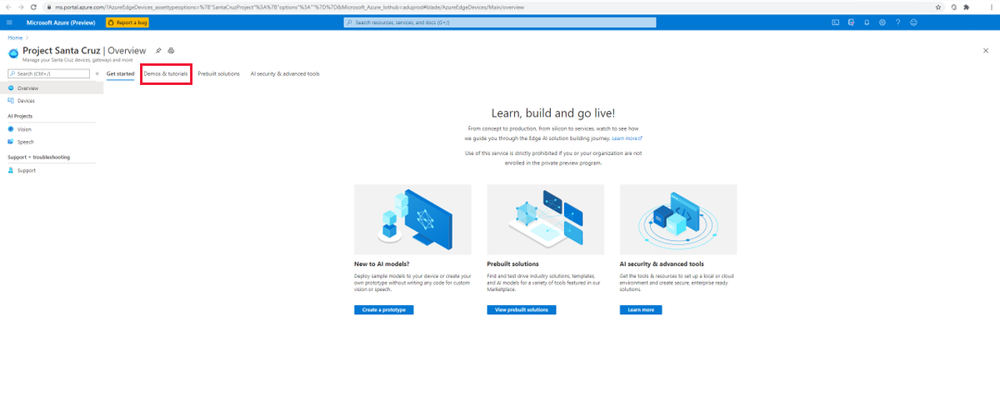

1. Click **Try out voice assistant templates** under **Speech tutorials and demos**. This will open a window on the right side of your screen.

1. Do the following in the window:

    1. In the **IoT Hub** dropdown menu, select the IoT hub to which your devkit is connected.

    1. In the **Device** dropdown menu, select your devkit.

    1. Select one of the available voice assistant templates.

    1. Click the **I agree to terms & conditions for this project** checkbox.

    1. Click **Create**.

    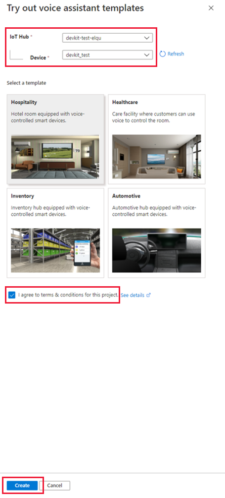

1. After clicking **Create**, the portal opens another window to create your speech theme resource. Do the following in the window:

    1. Select your Azure subscription in the **Subscription** box.

    1. Select your preferred resource group from the **Resource group** dropdown menu. If you would like to create a new resource group to use with your voice assistant, click **Create** under the dropdown menu and follow the prompts.

    1. For **Application prefix**, enter a name. This will be the prefix for your project/custom command name.

    1. Under **Region**, select the region to deploy resources to.

    1. Under **LUIS prediction pricing tier**, select **Standard** (the free tier does not support speech requests).

    1. Click the **Create** button. Resources for the voice assistant application will be deployed to your subscription.

        **WARNING :** Do NOT close the window until the portal has finished deploying the resource. Closing the window prematurely can result in unexpected behavior of the voice assistant. Once your resource has been deployed, the demo will be displayed.

    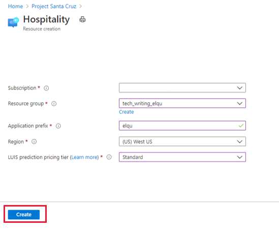

## Test out your voice assistant

To interact with your voice assistant, say the keyword followed by a command. When the Ear SoM recognizes your keyword, the device emits a chime (which you can hear if a speaker or headphones are connected), and the LEDs will blink blue. The LEDs will switch to racing blue while your command is processed. The voice assistant's response to your command will be printed in text in the demo window and emitted audibly through your speaker/headphones. The default keyword (listed next to **Custom Keyword**) is set to "Computer," and each template has a set of compatible commands that allow you to interact with virtual objects in the demo window. For example, if you are using the hospitality or healthcare demo, say "Computer, turn on TV" to turn on the virtual TV.

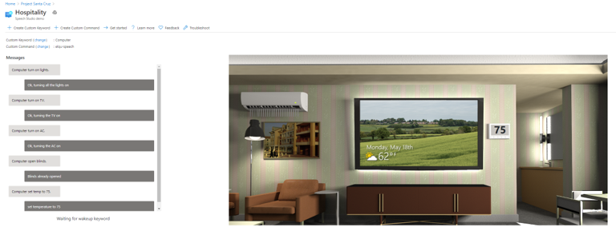)

### Hospitality and healthcare demo commands

Both the healthcare and hospitality demos have virtual TVs, lights, blinds, and thermostats you can interact with. The following commands (and additional variations) are supported:

* "Turn on/off the lights."
* "Turn on/off the TV."
* "Turn on/off the AC."
* "Open/close the blinds."
* "Set temperature to X degrees." (X is the desired temperature, e.g. 75.)

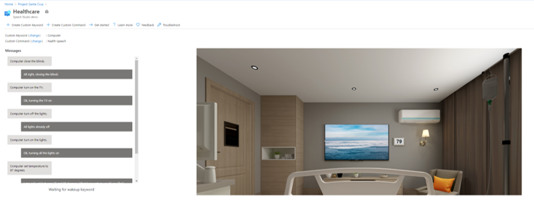

### Automotive demo commands

The automotive demo has a virtual seat warmer, defroster, and thermostat you can interact with. The following commands (and additional variations) are supported:

* "Turn on/off the defroster."
* "Turn on/off the seat warmer."
* "Set temperature to X degrees." (X is the desired temperature, e.g. 75.)
* "Increase/decrease the temperature by Y degrees."

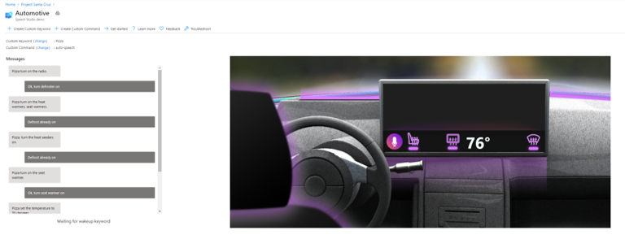

### Inventory demo commands

The inventory demo has a selection of virtual blue, yellow, and green boxes to interact with along with a virtual inventory app. The following commands (and additional variations) are supported:

* "Add/remove X boxes." (X is the number of boxes, e.g. 4.)
* "Order/ship X boxes."
* "How many boxes are in stock?"
* "Count Y boxes." (Y is the color of the boxes, e.g. yellow.)
* "Ship everything in stock."

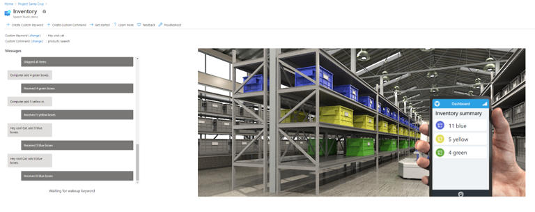

## Configure your keyword

To change your keyword, click **change** next to **Custom Keyword** in the demo window. Select one of the available keywords and click **Save**. You will be able to choose from a selection of prebuilt keywords and any custom keywords you have created.

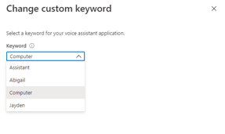

### Create a custom keyword

To create a custom keyword, click **+ Create Custom Keyword** near the top of the demo window. Enter your desired keyword, which can be a single word or a short phrase, select your **Speech resource** (this is listed next to **Custom Command** in the demo window and contains your application prefix), and click **Save**. Training for your custom keyword may complete in just a few seconds.

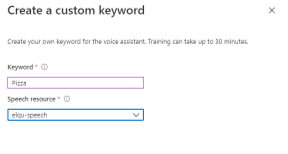

## Create a custom command

The portal also provides functionality for creating custom commands with existing speech resources. "Custom command" refers to the voice assistant application itself, not a specific command within the existing application. By creating a custom command, you are creating a new speech project, which you must further develop in [Speech Studio](https://speech.microsoft.com/).

To create a new custom command from within the demo window, click **+ Create Custom Command** at the top of the page and do the following:

1. Enter a name for your custom command.

1. Enter a description of your project (optional).

1. Select your preferred language.

1. Select your speech resource.

1. Select your LUIS resource.

1. Select your LUIS authoring resource or create a new one.

1. Click **Create**.

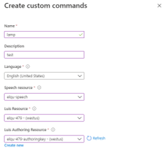

Once you create a custom command, you must go to [Speech Studio](https://speech.microsoft.com/) for further development. If you open Speech Studio and do not see your custom command listed, follow these steps:

1. On the left-hand menu panel in the Project Santa Cruz portal, click on **Speech** under **AI Projects**.

1. Select the **Commands** tab.

    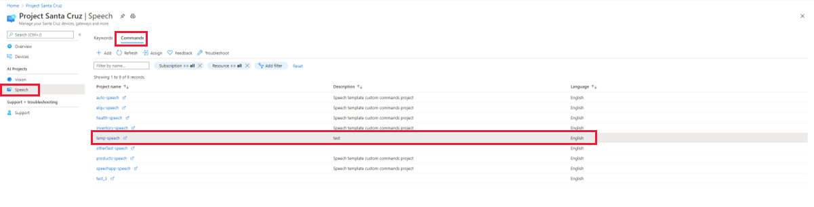

1. Select the custom command you wish to develop. This opens the project in Speech Studio.

    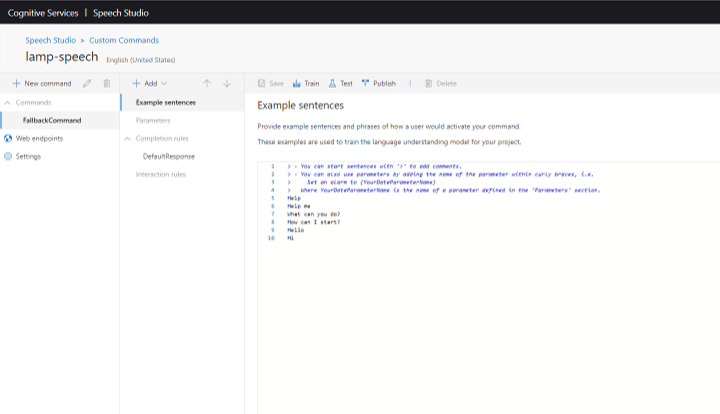

For more information on developing custom commands, please see the [Speech Service documentation](https://docs.microsoft.com/en-us/azure/cognitive-services/speech-service/custom-commands).

## Clean up resources

Once you are done working with the demo, follow these steps to clean up the speech resources you deployed during this quickstart guide:

1. From the Azure portal, select **Resource groups** from the left menu panel or type it into the search bar.

    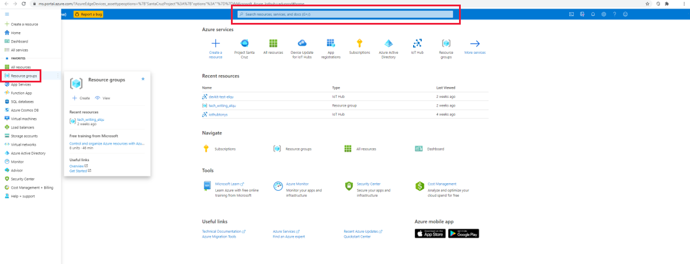

1. Select your resource group.

1. Select all six resources that contain your application prefix and click the **Delete** icon on the top menu panel.

    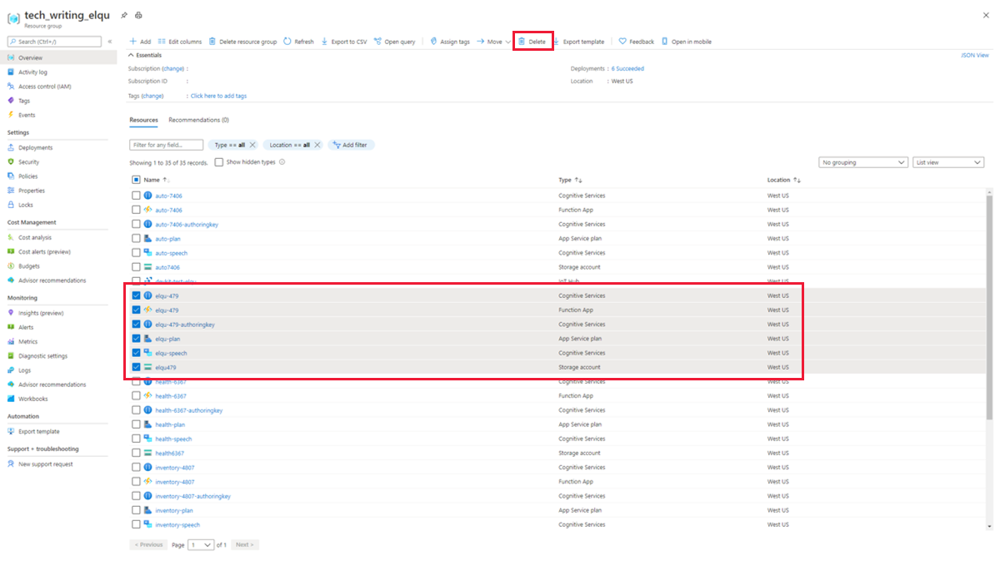

1. To confirm deletion, type **yes** in the confirmation box, verify you have selected the correct resources, and click **Delete**.

    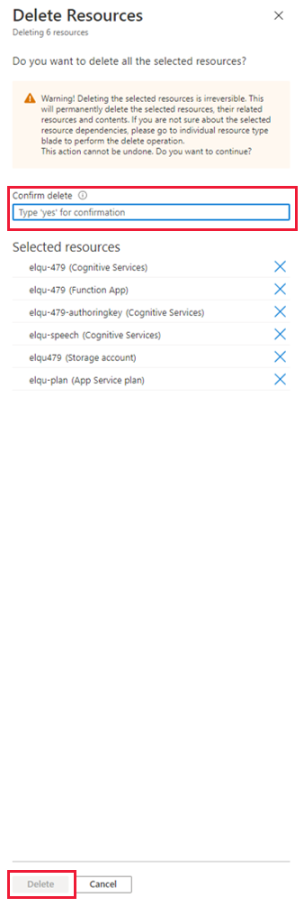

**WARNING:** This will remove any custom keywords created with the speech resources you are deleting, and the voice assistant demo will no longer function.

## Troubleshooting

### Project Santa Cruz is not available in the Azure portal

To access the Project Santa Cruz portal, which is a preview extension, use this [special link](https://go.microsoft.com/fwlink/?linkid=2135819).

### Voice assistant was created but does not respond to commands

Check the LED lights on the Ear SoM:

* Three solid blue lights indicate that the voice assistant is ready and waiting for the keyword.

* If the center LED (L02) is white, the devkit completed initialization and needs to be configured with a keyword.

* Any combination of green lights indicates that the Ear SoM has not completed initialization yet. Initialization may take a few minutes to complete.

For more information about the Ear SoM LED indicators, please see this [troubleshooting article](https://github.com/microsoft/Project-Santa-Cruz-Preview/blob/main/user-guides/general/troubleshooting/ear_som_speech_module_troubleshooting.md#understanding-ear-som-led-indicators).

### Voice assistant does not respond to a custom keyword created in Speech Studio

This may occur if the speech module is out of date. Follow these steps to update the speech module to the latest version:

1. Click on **Devices** in the left-hand menu panel of the Project Santa Cruz portal homepage.

1. Find and select your device.

    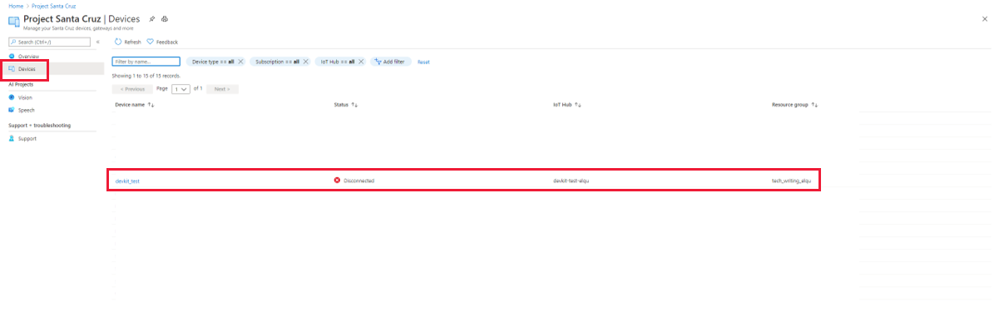

1. In the device window, select the **Speech** tab.

1. Check the speech module version. If an update is available, you will see an **Update** button next to the version number.

    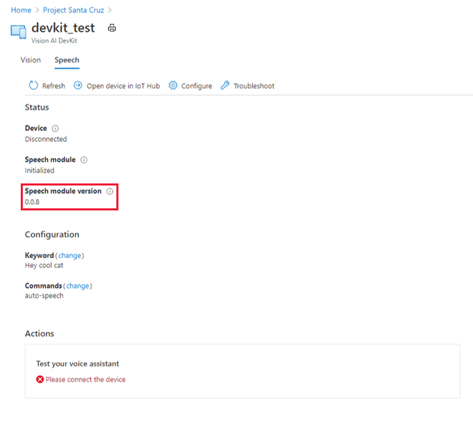

1. Click **Update** to deploy the speech module update. The update process generally takes 2-3 minutes to complete.

## Provide feedback

After completing the no-code speech solution, please provide feedback on your experience via this [questionnaire](https://forms.office.com/Pages/ResponsePage.aspx?id=v4j5cvGGr0GRqy180BHbRzoJxrXKT0dEvfQyxsA0h8lUQU1YTDFUNkhBM005MFlYQkVQSFIxUURFRy4u). Your feedback will help us continue to fine-tune and improve the no-code speech experience.

For more information on Project Santa Cruz Quests and to provide feedback on other experiences, please visit the [test scenarios page](https://github.com/microsoft/Project-Santa-Cruz-Private-Preview/blob/main/user-guides/general/test-scenarios.md).

## Next Steps

Now that you have created a no-code speech solution, try creating a [no-code vision solution](https://github.com/microsoft/Project-Santa-Cruz-Private-Preview/blob/main/user-guides/prototyping/create-nocode-vision.md) for your devkit.
