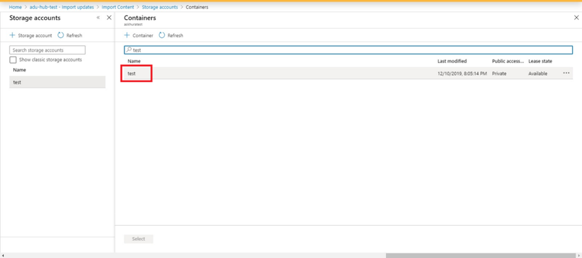
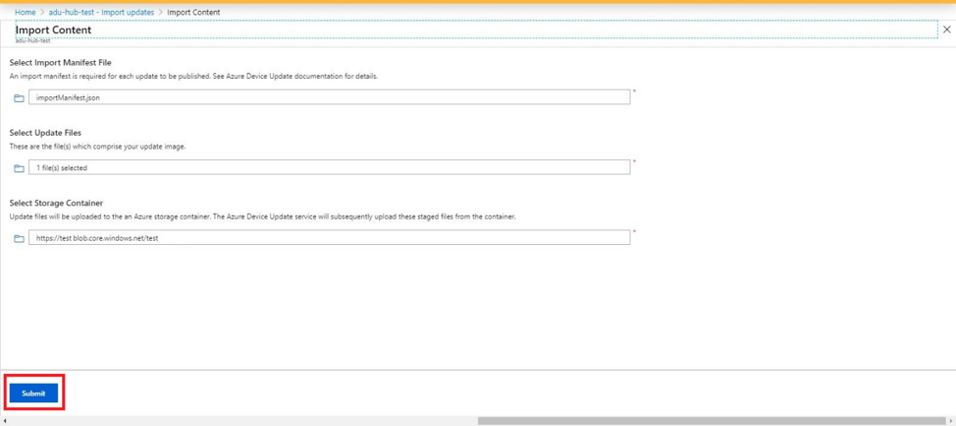

<!---
title: Over-the-air (OTA) updating                     # the article title to show on the browser tab
description: Walks a user through the over-the-air (OTA) updating process for Project Santa Cruz Private Preview (July 2020). 
author: elqu20      # the author's GitHub ID - will be auto-populated if set in settings.json
ms.author: v-elqu     # the author's Microsoft alias (if applicable) - will be auto-populated if set in settings.json
ms.date: {@date}           # the date - will be auto-populated when template is first applied
ms.topic: reference  # the type of article
--->
# Over-the-air (OTA) updating

With Project Santa Cruz, you can update your devkit carrier board software over-the-air (OTA) or via [USB](https://github.com/microsoft/Project-Santa-Cruz-Private-Preview/blob/main/user-guides/updating/usb_updating.md). This guide will walk you through the OTA update process. Prior to executing an OTA update, you must work through onboarding and OOBE to set up an IoT Hub for use with Project Santa Cruz, connect your devkit to a Wi-Fi network, and provision your devkit to your Project Santa Cruz IoT Hub. For a full list of prerequisites, please see the next section.

## Prerequisites

- Host PC.
- Project Santa Cruz Development Kit.
- [PuTTY](https://www.chiark.greenend.org.uk/~sgtatham/putty/latest.html).
- [Onboarding](https://github.com/microsoft/Project-Santa-Cruz-Private-Preview/blob/main/user-guides/getting_started/azure-subscription-onboarding.md) complete with ADU enabled (please wait 2 business days after completing this).
- [OOBE](https://github.com/microsoft/Project-Santa-Cruz-Private-Preview/blob/main/user-guides/getting_started/oobe.md) complete.
- [General OTA Update Prerequisites](https://github.com/microsoft/Project-Santa-Cruz-Private-Preview/blob/main/user-guides/updating/ota_os_fw_update_prerequisites.md) have been satisfied.

## Getting started

1. Plug in and power on your devkit.

1. On your PC, navigate to the [Project Santa Cruz update management website](https://projectsantacruz.microsoft.com/Download). Download the image file (.swu) and manifest file (.json) of your desired update.

    

1. Login to the [Azure Portal](https://ms.portal.azure.com/?feature.canmodifystamps=true&Microsoft_Azure_Iothub=aduprod#home) (this link allows you to access the Azure Device Update extension, which is a Private Preview service). Click **All resources** under the **Azure services** section of the portal homepage. Alternatively, enter **All resources** into the search bar at the top of the page.

    

1. On the **All resources** page, click on the name of the IoT Hub that was provisioned to your devkit during the OOBE process.

1. On the left side of the **IoT Hub** page, click on **IoT Edge** under **Automatic Device Management**. On the **IoT Edge** page, find the **Device ID** of your devkit. The status of your device’s **Runtime Response** should be **OK**. If an error message is present, resolve the error before proceeding with the OTA update procedure. Click the **Device ID** of your devkit to open its **IoT Edge** device page.

    

1. On your devkit’s **IoT Edge** device page, the **Runtime Status** of all installed modules should be listed as **running**.

    

## Import an update

If you have [Automatic Import of Updates (AIU)](https://github.com/microsoft/Project-Santa-Cruz-Preview/blob/main/user-guides/updating/automatic_import_of_updates.md) turned ON, you can skip this section and go directly to the next section, **Create a group**.

1. On the left-hand menu panel, select **Device Updates** under **Automatic Device Management**. Note: If you can’t see this UI, make sure you are logging in to the Azure Portal using [this link](https://ms.portal.azure.com/?feature.canmodifystamps=true&Microsoft_Azure_Iothub=aduprod#home), which allows you to access the Azure Device Update extension.

    

1. You will see several tabs across the top of the screen. Select the **Updates** tab.

    

1. Select **+ Import New Update** below the **Ready to Deploy** header.

    

1. Click on the boxes under **Select Import Manifest File** and **Select Update Files** to select the appropriate manifest file (.json) and update file (.swu), which you downloaded from the [Project Santa Cruz update management website](https://projectsantacruz.microsoft.com/Download) in the previous section. Please note that only one update file will be needed for re-imaging the carrier board of your devkit.

    

1. Select the folder icon or text box under **Select a storage container**, then select the appropriate storage account.

    

1. If you’ve already created a storage container, you can re-use it. Otherwise, select **+ Container** to create a new storage container for OTA updates. Select the container you wish to use and click **Select**.

    

1. Select **Submit** to start the import process.

    

1. The import process begins, and you are redirected to the **Import History** tab of the **Device Updates** page. Click **Refresh** to monitor progress while the import process completes. Depending on the size of the update, this may take a few minutes or longer.

    

1. When the **Status** column indicates the import has succeeded, select the **Ready to Deploy** tab. You should now see your imported update in the list.
  
    

## Create a group

Azure Device Update allows you to deploy an update to a group of IoT devices. To create a group, you must add a tag to your target set of devices in IoT Hub. Follow the steps outlined below to add and update a tag.

**NOTE**: If you have already created a group, you can skip directly to the next section, **Deploy an update**.

 Limitations:

  - You can add any value to your tag except for "Uncategorized," which is a reserved value.
  - Tag value cannot exceed 255 characters.
  - Tag value can only contain these special characters: “.”,”-“,”_”,”~”.
  - Tag and group names are case sensitive.
  - A device can only have one tag. Any subsequent tag added to the device will override the previous tag.
  - A device can only belong to one group.

### Method 1: using direct twin updates to add a tag (easy)

Tags can also be added or updated in device twin directly.

1. Log into the Azure Portal using [this link](https://ms.portal.azure.com/?feature.canmodifystamps=true&Microsoft_Azure_Iothub=aduprod#home) and navigate to your IoT Hub.

2. From **IoT Edge** on the left navigation pane, find your Project Santa Cruz device and navigate to the Device Twin.

3. In the Device Twin, delete any existing ADU tag value by setting them to null.

4. Add a new ADU tag value as shown below. Learn more about device twin JSON document tags [here](https://docs.microsoft.com/en-us/azure/iot-hub/iot-hub-devguide-device-twins#device-twins).

```JSON
"tags": {
"ADUGroup": "<CustomTagValue>"
}
```

### Method 2: using jobs to add a tag (advanced)

1. Follow [these steps](https://docs.microsoft.com/azure/iot-hub/iot-hub-csharp-csharp-schedule-jobs) to add a tag to your devices using Jobs.

    **NOTE**: Tags can only be successfully added to your device after it has been connected to ADU. It is possible to schedule a Job on multiple devices to add or update their Device Update tags. To do so, please follow [these examples](https://docs.microsoft.com/azure/iot-hub/iot-hub-devguide-jobs).

    **NOTE**: This action may exceed your current daily IoT Hub message quota. It is recommended to change no more than 50,000 device twin tags at a time, otherwise you may need to buy additional IoT Hub units. Details can be found at [Quotas and throttling](https://docs.microsoft.com/azure/iot-hub/iot-hub-devguide-quotas-throttling#quotas-and-throttling).

1. Create a group by selecting an existing IoT Hub tag:

    1. Navigate back to your IoT Hub page.

    1. Select **Device Updates** under **Automatic Device Management** on the left-hand menu panel.

    1. Select the **Groups** tab. This page will display the number of ungrouped devices connected to Device Update.

        

    1. Select **+ Add** to create a new group.

    1. Select an IoT Hub tag from the list and click **Submit**.

        

    1. Once the group is created, the update compliance chart and groups list will update. The chart shows the number of devices in various states of compliance: **On latest update**, **New updates available**, **Updates in progress**, and **Not yet grouped**.

        

## Deploy an update

1. You should see your newly created group with a new update listed under **Available updates** (you may need to refresh once). Select the update.

1. Confirm that the correct device group is selected as the target device group. Select a **Start date** and **Start time** for your deployment, then click **Create deployment**.

    

1. Check the compliance chart. You should see the update is now in progress.

    

1. After your update has completed, your compliance chart will reflect your new update status.

    

1. Select the **Deployments** tab at the top of the **Device updates** page.

    

1. Select your deployment to view the deployment details. You may need to click **Refresh** until the **Status** changes to **Succeeded**.

    

## Update confirmation

1. To verify that the correct update was installed, navigate back to the **Device Twin** page for your devkit (IoT Hub > Automatic Device Management > IoT Edge > Device Twin). **swVersion** will display the current software, which should match the update that was just installed.

    

1. As an additional verification step, SSH into your devkit to check the ADU software version.

    1. First, connect to the devkit's SoftAP (default password = santacruz).

          

    1. Open PuTTY. Enter the following and click **Open** to SSH into your devkit:

        1. Host Name: 10.1.1.1
        1. Port: 22
        1. Connection Type: SSH

          

    1. Log in to the PuTTY terminal. If you set up an SSH username and password during the [OOBE]( https://github.com/microsoft/Project-Santa-Cruz-Private-Preview/blob/main/user-guides/getting_started/oobe.md), enter those login credentials when prompted. Otherwise, enter the following:  

        1. login as: root
        1. Password: p@ssw0rd

    1. Enter the following in the PuTTY terminal:

        ```console
        cat /etc/adu-version
        ```

        The terminal will display the current software version, which should match the installed update.

        

## Provide feedback

After completing the OTA OS update experience as well as the [USB OS update experience](https://github.com/microsoft/Project-Santa-Cruz-Private-Preview/blob/main/user-guides/updating/usb_updating.md) and [OTA firmware update experience (Eye/Ear SoM)](https://github.com/microsoft/Project-Santa-Cruz-Private-Preview/blob/main/user-guides/updating/ear_som_firmware.md), please provide feedback on your experience via this [questionnaire](https://forms.office.com/Pages/ResponsePage.aspx?id=v4j5cvGGr0GRqy180BHbR-EYOjUzOMlKvDaulVXd95tUNDc1V05EMDA2NjBRVDc5UlZBMVkwRjRNQSQlQCN0PWcu). Your feedback will help us continue to fine-tune and improve the update experiences.

For more information on Project Santa Cruz Quests and to provide feedback on other experiences, please visit the [test scenarios page](https://github.com/microsoft/Project-Santa-Cruz-Private-Preview/blob/main/user-guides/general/test-scenarios.md).

## Known Issues
If you encounter any of these issues, it is not necessary to open a bug. If you have trouble with any of the workarounds, please open an [Issue](https://github.com/microsoft/Project-Santa-Cruz-Preview/issues).

|Area|Description of Issue|Workaround|
|:------|:--|:--|
| Device update | Containers do not run after an OTA update. | SSH into the device and enter the following command: `systemctl restart iotedge`. This will restart all containers, including IoT Edge. |
| Device update | Users may get a message that the update failed, even if it succeeded. | Confirm the device updated by navigating to the Device Twin for the device in IoT Hub. This is fixed after the first update. |
| Device update | Users may lose their Wi-Fi connection settings after their first update. | Run through OOBE after updating to setup the Wi-Fi connection. This is fixed after the first update. |
| Device update | After performing an OTA update, users can no longer logon via SSH using previously created user accounts, and new SSH users cannot be created through OOBE. This issue affects systems performing OTA updates from the following pre-installed image versions: 2020.110.114.105 and 2020.109.101.105. | To recover your user profiles, preform these steps after the OTA update: <br> [SSH into your devkit](https://github.com/microsoft/Project-Santa-Cruz-Preview/blob/main/user-guides/general/troubleshooting/ssh_and_serial_connection_setup.md) using “root” as the username. If you disabled the SSH “root” user login via OOBE, you must re-enable it. Run this command after successfully connecting: <br> ```mkdir -p /var/custom-configs/home; chmod 755 /var/custom-configs/home``` <br> To recover previous user home data, run the following command: <br> ```mkdir -p /tmp/prev-rootfs && mount /dev/mmcblk0p3 /tmp/prev-rootfs && [ ! -L /tmp/prev-rootfs/home ] && cp -a /tmp/prev-rootfs/home/* /var/custom-configs/home/. && echo "User home migrated!"; umount /tmp/prev-rootfs``` |
| Device update | After taking an OTA update, update groups are lost. | Update the device’s tag by following [these instructions](https://github.com/microsoft/Project-Santa-Cruz-Preview/blob/main/user-guides/updating/ota_update.md#method-1-using-direct-twin-updates-to-add-a-tag-easy). |
